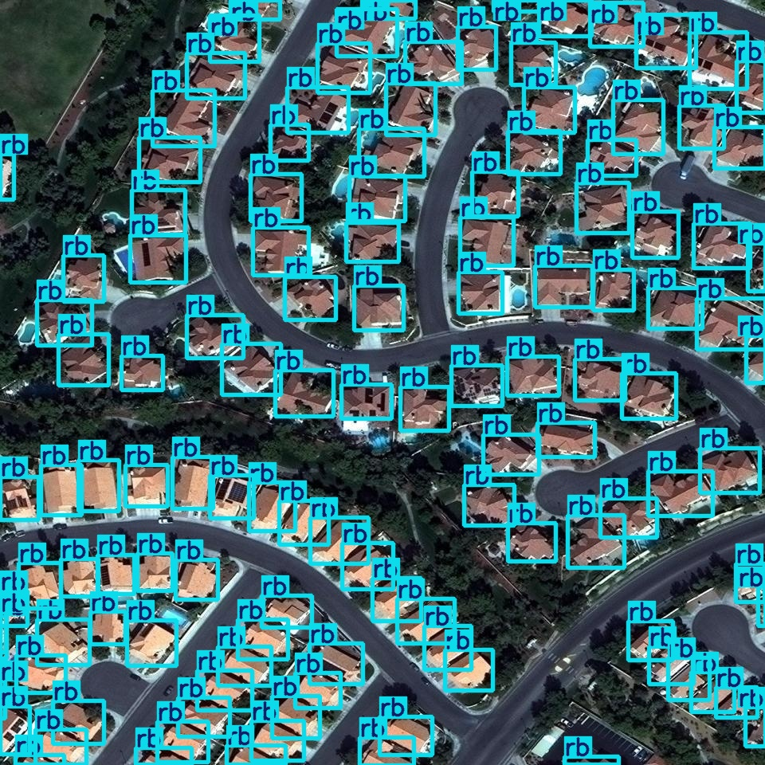
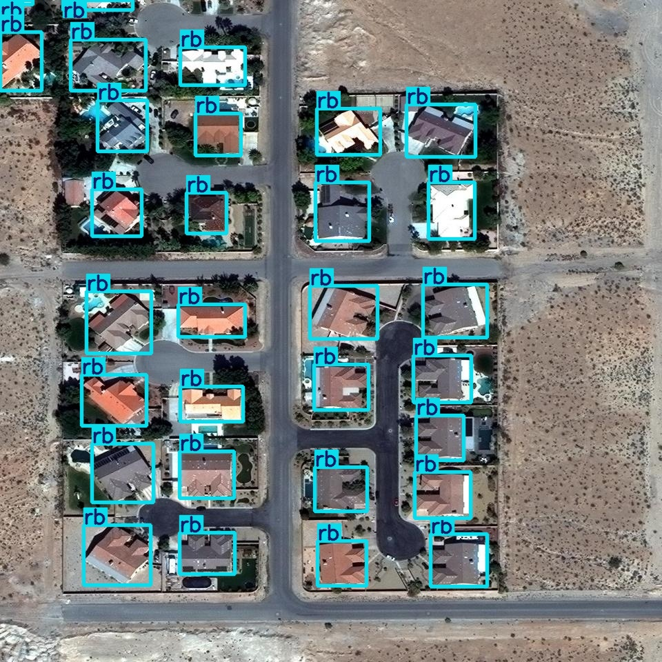
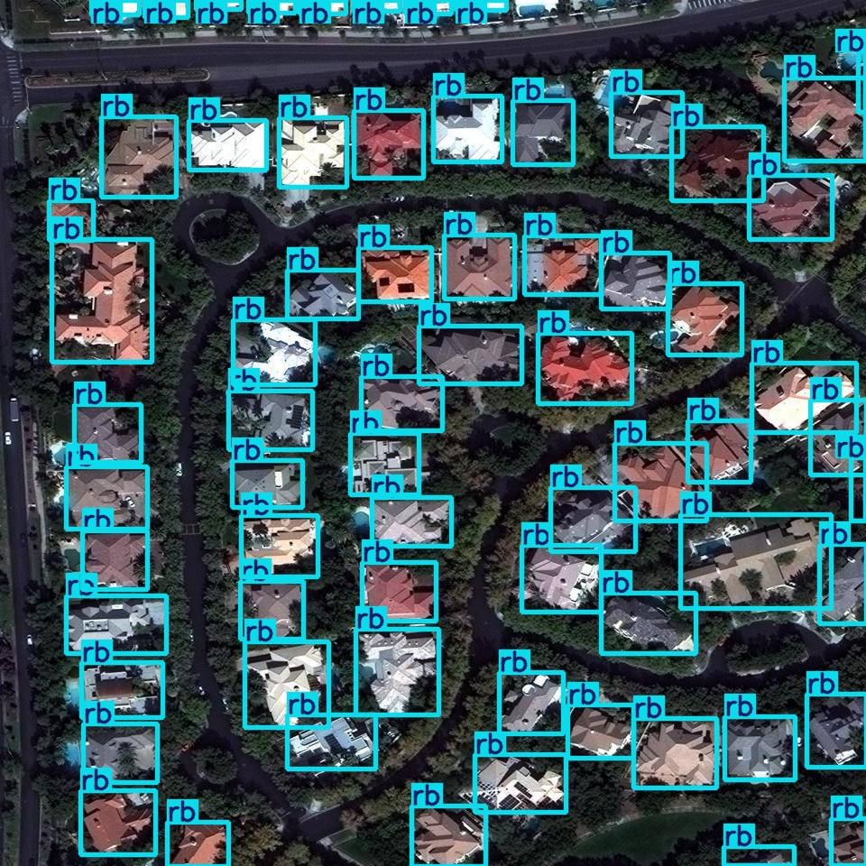
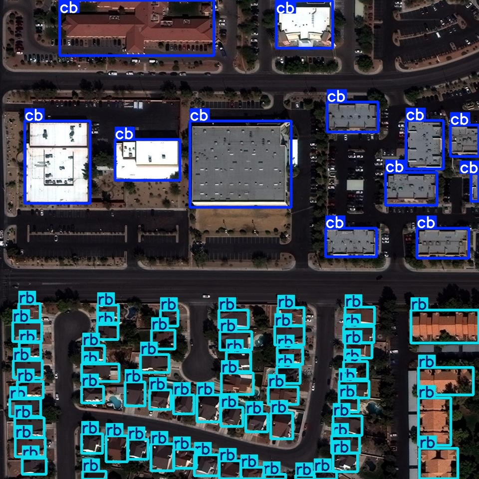
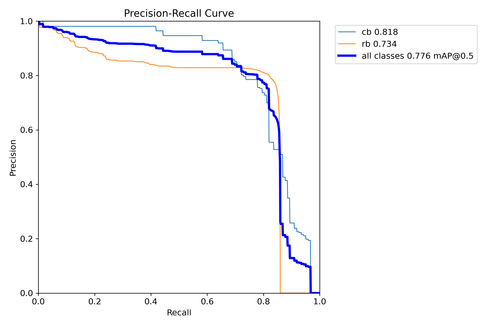
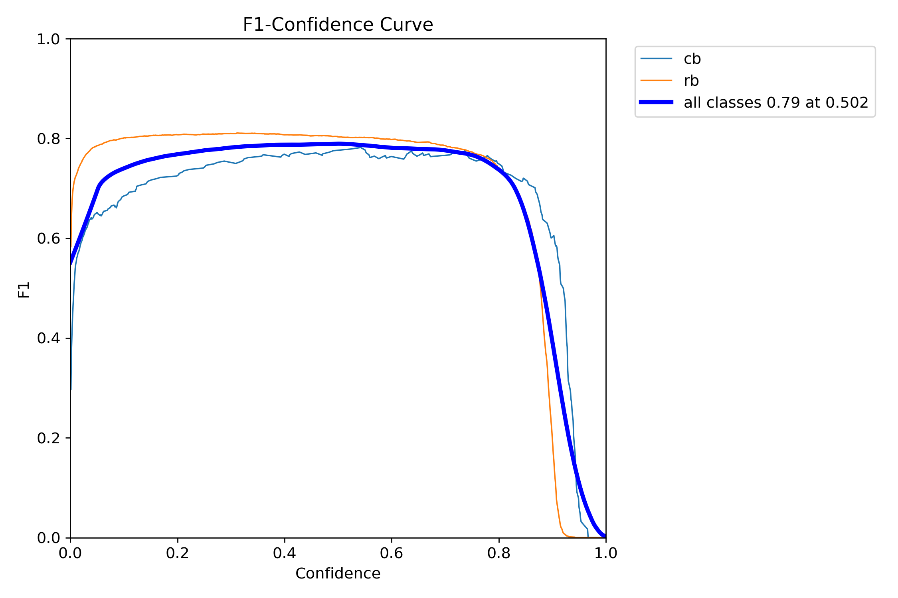
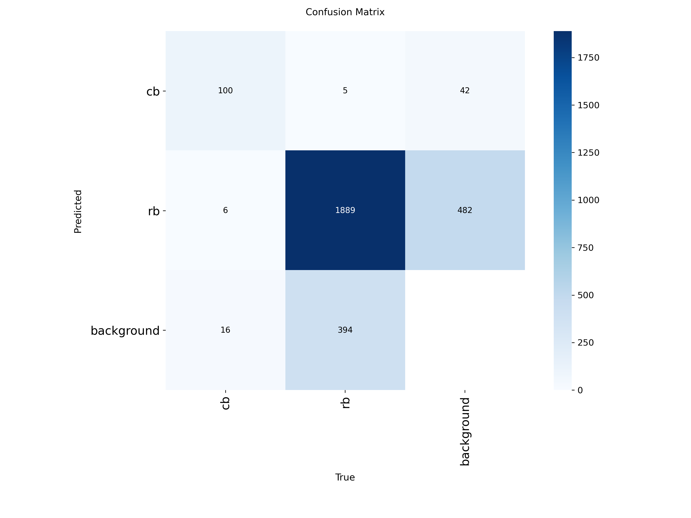

# Building Rooftop Detection using YOLOv8

A deep learning-based rooftop detection pipeline built using YOLOv8 and trained on the SpaceNet aerial imagery dataset for detecting buildings from satellite and drone imagery.

This project focuses on high-accuracy rooftop localization using custom augmentation strategies, hyperparameter optimization, and GPU-accelerated object detection training.

---

# Project Overview

Accurate rooftop detection from aerial imagery is important in:

- Urban planning
- Disaster management
- Infrastructure monitoring
- Smart city analytics
- Population estimation
- Geospatial intelligence

This project implements a complete end-to-end object detection workflow capable of detecting rooftops from high-resolution satellite imagery using YOLOv8.

---

# Key Features

- YOLOv8-based rooftop detection
- SpaceNet aerial imagery integration
- Custom training pipeline
- Hyperparameter tuning
- Data augmentation optimization
- GPU-accelerated training
- Validation and inference pipeline
- Precision, Recall, and mAP evaluation
- Real-world satellite image predictions

---

# Tech Stack

| Technology | Usage |
|---|---|
| Python | Core programming |
| PyTorch | Deep learning backend |
| Ultralytics YOLOv8 | Object detection framework |
| OpenCV | Image processing |
| NumPy | Numerical operations |
| Google Colab | GPU training environment |
| CUDA | GPU acceleration |

---

# Dataset

## SpaceNet Dataset

The model was trained using aerial satellite imagery from the SpaceNet dataset containing rooftop annotations and building bounding boxes.

Dataset includes:
- High-resolution satellite imagery
- Building rooftop labels
- Dense urban scene data
- Object localization annotations

## Dataset Access
[Download Dataset](https://drive.google.com/file/d/1Q7CjscLzxEALB5039cl8aOPv8hRU-XcZ/view?usp=sharing)

---

# Model Configuration

| Parameter | Value |
|---|---|
| Model | YOLOv8m |
| Epochs | 100 |
| Image Size | 768 |
| Batch Size | 16 |
| Optimizer | SGD |
| Initial Learning Rate | 0.01 |
| Patience | 20 |

---

# Data Augmentation Techniques

The following augmentation strategies were applied to improve model generalization:

- HSV augmentation
- Mosaic augmentation
- MixUp
- Scaling
- Translation
- Horizontal flipping
- Rotation augmentation

These techniques improved rooftop detection robustness across varying aerial scenes.

---

# Model Performance

## Final Validation Metrics

| Metric | Score |
|---|---|
| Precision | 79.3% |
| Recall | 78.7% |
| mAP@50 | 77.6% |
| mAP@50-95 | 61.6% |

---

# Detection Performance Analysis

The model achieved:
- Strong rooftop localization accuracy
- High-confidence predictions
- Stable convergence during training
- Balanced precision-recall performance
- Efficient inference on aerial imagery

The detector performs effectively even in dense urban regions containing multiple rooftops.

---

# Inference Speed

| Operation | Speed |
|---|---|
| Preprocess | 6.2 ms |
| Inference | 38.9 ms |
| Postprocess | 2.3 ms |

---

# Sample Predictions

## Rooftop Detection Results

The model successfully detects multiple rooftops from satellite imagery with strong confidence scores and accurate bounding box localization.

### Prediction Output 1



### Prediction Output 2



### Prediction Output 3



### Prediction Output 4



---

# Evaluation Visualizations

## Precision-Recall Curve



---

## F1 Score Curve



---

## Confusion Matrix



---

# Project Structure

```bash
Building-Rooftop-Detection/
│
├── README.md
├── requirements.txt
├── hyperparameters_used.txt
├── .gitignore
├── Building_Rooftop_Detection_Pipeline.ipynb
├── Code_Building_Rooftop_Detection_Pipeline.ipynb
│
├── images/

```

---

# Pretrained Model

Download the trained rooftop detection model:

➡️ [best_submission_model.pt](https://drive.google.com/file/d/1LNFnWbxaQjcuwJnmqKaBfsklGFLP50qQ/view?usp=sharing)

---

# Installation

Clone the repository:

```bash
git clone https://github.com/your-username/building-rooftop-detection-yolov8.git
cd building-rooftop-detection-yolov8
```

Install required dependencies:

```bash
pip install -r requirements.txt
```

---

# Training

Run model training:

```bash
python train.py
```

Or execute the provided notebook:

```bash
rooftop_detection_pipeline.ipynb
```

---

# Inference

Run prediction on aerial images:

```bash
python inference.py
```

Example:

```python
from ultralytics import YOLO

model = YOLO("best_submission_model.pt")

results = model.predict(
    source="sample_image.jpg",
    conf=0.25,
    save=True
)
```

---

# Key Learning Outcomes

This project involved:

- Object detection pipeline development
- Deep learning optimization
- Satellite imagery analysis
- YOLOv8 architecture training
- Hyperparameter tuning
- GPU-based training workflows
- Model evaluation using mAP metrics
- Real-world computer vision deployment concepts

---

# Future Improvements

- Real-time rooftop detection system
- Web deployment interface
- Segmentation-based rooftop extraction
- Larger geospatial datasets
- TensorRT optimization
- Cloud deployment pipeline
- GIS integration support

---

# Acknowledgements

- Ultralytics YOLOv8
- SpaceNet Dataset
- PyTorch
- Google Colab

---

# Author

Lavisha Oberoi

If you found this project useful, feel free to star the repository.
